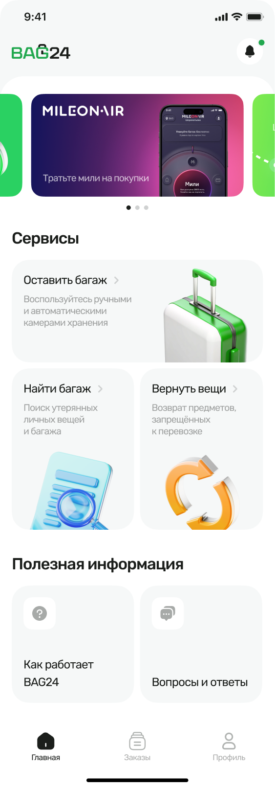
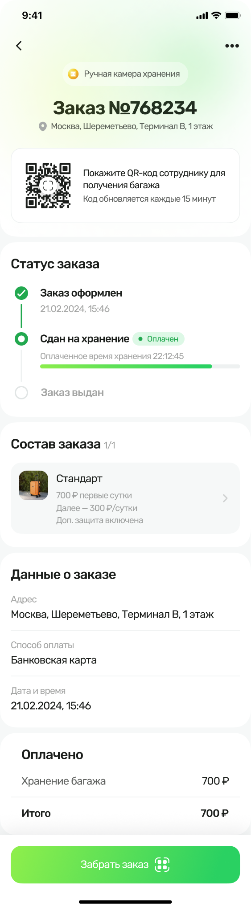
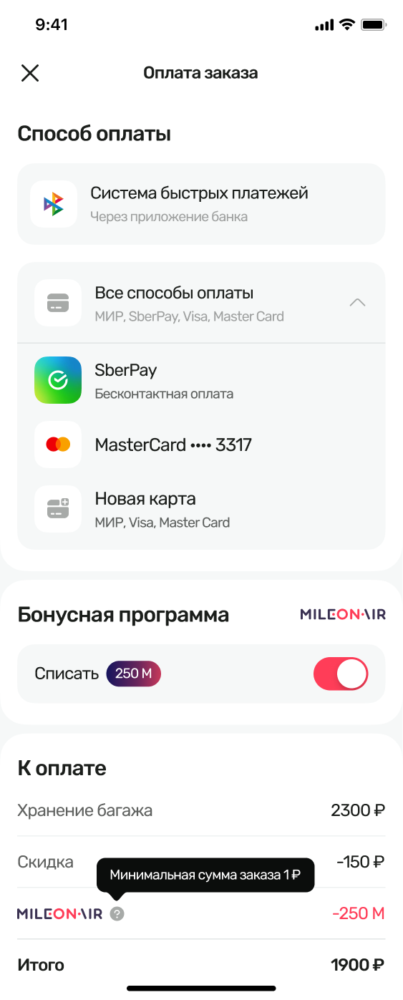

# BAG24

Мобильное приложение сервиса BAG24 для хранения, поиска и возврата багажа. Приложение помогает выбрать камеру хранения, оформить и оплатить заказ, а затем получить вещи по обновляемому QR-коду.

## Возможности

- **Хранение багажа** — выбор аэропорта и камеры хранения, просмотр тарифов и оформление заказа.
- **Управление заказами** — статусы хранения, состав заказа, время, стоимость и получение по QR-коду.
- **Оплата** — СБП, банковские карты и бонусная программа «Миллион призов».
- **Поиск и возврат вещей** — отдельные сценарии для потерянного и запрещённого к перевозке багажа.
- **Профиль и безопасность** — вход по коду, PIN и биометрическая аутентификация.
- **Уведомления** — push-уведомления через Firebase Cloud Messaging и локальные уведомления.

## Скриншоты

<table>
  <tr>
    <th align="center">Главная</th>
    <th align="center">Оплаченный заказ</th>
    <th align="center">Способ оплаты</th>
  </tr>
  <tr>
    <td align="center" valign="top">
      
    </td>
    <td align="center" valign="top">
      
    </td>
    <td align="center" valign="top">
      
    </td>
  </tr>
</table>

## HMS-сборка

По умолчанию проект использует GMS и Firebase. Для HMS-сборки замените GMS-пакет на `packages/platform_plugins/hms/push_notification_service` в секциях `workspace` и `dependencies` корневого `pubspec.yaml`, затем включите закомментированные Huawei-блоки в Android Kotlin DSL и установите `hms=true` в `android/gradle.properties`. Для полностью независимой HMS-сборки также отключите применение Google Services в `android/app/build.gradle.kts`.
